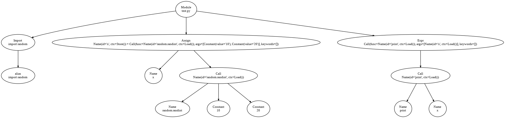

---

# Trial AST

This week, my focus shifted towards implementing the Trial Graph Visualization based on `code_component`, structured in the form of an Abstract Syntax Tree (AST). This week, my focus shifted towards implementing the Trial Graph Visualization based on `code_component`, structured in the form of an Abstract Syntax Tree (AST). 

Initially, I began by reading the source code directly to understand the desired output format. This step was crucial for comprehending the structure and layout of the AST representation of the code components. The graph format is in DOT using Graphviz for simplicity in development.

The development process involved two main approaches:

1. Reading from File: The first approach involved reading the entire script from a file and generating the AST. This method provided the correct output, as it accurately captured the structure and content of the code.
2. Reading from Database: The second approach involved visualizing the AST using raw data queried directly from the database. This method aimed to integrate the visualization process with noWorkflow's existing database structure but initially resulted in some issues with label accuracy.

# Code Explanation

## Database Model Definitions

The database models for `CodeComponent` and `Composition` are defined as follows:

```python
from sqlalchemy import create_engine, Column, Integer, String, Text, ForeignKey, and_
from sqlalchemy.ext.declarative import declarative_base
from sqlalchemy.orm import sessionmaker, relationship

Base = declarative_base()

class CodeComponent(Base):
    __tablename__ = 'code_component'
    trial_id = Column(String, primary_key=True)
    id = Column(Integer, primary_key=True)
    name = Column(String)
    type = Column(String)
    mode = Column(String)
    first_char_line = Column(Integer)
    first_char_column = Column(Integer)
    last_char_line = Column(Integer)
    last_char_column = Column(Integer)
    container_id = Column(String)

class Composition(Base):
    __tablename__ = 'composition'
    trial_id = Column(String, primary_key=True)
    id = Column(Integer, primary_key=True)
    part_id = Column(Integer, ForeignKey('code_component.id'))
    whole_id = Column(Integer, ForeignKey('code_component.id'))
    type = Column(Text)
    position = Column(Integer)
    extra = Column(Text)
    part = relationship("CodeComponent", foreign_keys=[part_id])
    whole = relationship("CodeComponent", foreign_keys=[whole_id])
```

These classes define the schema for the `code_component` and `composition` tables, which store information about the code components and their compositions, respectively.

## Querying the Database

The following code queries the database to retrieve the relevant `CodeComponent` and `Composition` entries:

```python
engine = create_engine('sqlite:////content/db.sqlite')
Session = sessionmaker(bind=engine)
session = Session()

trial_id = 'b1ef84c0-b50f-4291-9b03-a961347dc9bc'

code_components = session.query(CodeComponent).filter(and_(CodeComponent.trial_id == trial_id, CodeComponent.type != "syntax")).all()
compositions = session.query(Composition).filter(and_(Composition.trial_id == trial_id, Composition.type != '*op_pos')).all()
```

The data will mainly be queried from the database. This involved querying code_components from the database, carefully filtering out entries where `type` is not equal to "`syntax`". 
Similarly, for compositions, I filtered out entries where `type` is not equal to "`*op_pos`", as these types do not contribute to the construction of AST nodes. 

## Building the AST from Database Entries

### construct_node

The function below converts a `CodeComponent` entry into an AST node, based on its type:

```python
def construct_node(component):
        if component.type == 'script':
            return ast.Module(name=component.name, body=[])
        elif component.type == "literal":
            return ast.Constant(value=component.name)
        elif component.type == 'function_def':
            return ast.FunctionDef(name=component.name, args=None, body=[], decorator_list=[], lineno=component.first_char_line,col_offset=component.first_char_column)
        elif component.type == 'arguments':
            args_list = component.name.split(',')
            arg_nodes = [ast.arg(arg=arg.strip(), annotation=None) for arg in args_list]
            return ast.arguments(args=arg_nodes, vararg=None, kwonlyargs=[], kw_defaults=[], kwarg=None, defaults=[])
        elif component.type == 'import':
            name_ = ' '.join(component.name.split()[1:])
            alias_name = name_.split('as ')[-1].strip() if ' as ' in name_ else name_
            return ast.Import(names=[ast.alias(name=component.name, asname=alias_name)])
        elif component.type == 'import_from':
            name_ = ' '.join(component.name.split()[1:])
            parts = name_.split()
            module_name = parts[1]
            alias_name = parts[3] if len(parts) > 3 else module_name
            return ast.ImportFrom(module=module_name, names=[ast.alias(name=module_name, asname=alias_name)], level=0)
        elif component.type == 'expr':
            return ast.Expr(value=None)
        elif component.type == 'assign':
            return ast.Assign(targets=[ast.Name(id=component.name.split('=')[0].strip(), ctx=ast.Store())], value=ast.Constant(value=None))
        elif component.type == "return":
            return ast.Return(value=None)
        elif component.type == "for":
            target = ast.Name(id=component.name.split()[1], ctx=ast.Store())
            iter_node = ast.Name(id=component.name.split()[3].strip(':'), ctx=ast.Load())
            body = []
            return ast.For(target=target, iter=iter_node, body=body, orelse=[])
        elif component.type == "if":
            return ast.If(test = None, body = [] ,orelse = [])
        elif component.type == "add":
            left, right = component.name.split(' + ')
            return ast.BinOp(left=ast.Name(id=left.strip(), ctx=ast.Load()), op=ast.Add(), right=ast.Name(id=right.strip(), ctx=ast.Load()))
        elif component.type == "sub":
            left, right = component.name.split(' - ')
            return ast.BinOp(left=ast.Name(id=left.strip(), ctx=ast.Load()), op=ast.Sub(), right=ast.Name(id=right.strip(), ctx=ast.Load()))
        elif component.type == "div":
            left, right = component.name.split(' / ')
            return ast.BinOp(left=ast.Name(id=left.strip(), ctx=ast.Load()), op=ast.Div(), right=ast.Name(id=right.strip(), ctx=ast.Load()))
        elif component.type == "mult":
            left, right = component.name.split(' * ')
            return ast.BinOp(left=ast.Name(id=left.strip(), ctx=ast.Load()), op=ast.Mult(), right=ast.Name(id=right.strip(), ctx=ast.Load()))
        elif component.type == "call":
            func_name = component.name.split('(')[0]
            args_str = component.name.split('(', 1)[1].rsplit(')', 1)[0]
            args = [arg.strip() for arg in args_str.split(',')]
            args_nodes = [ast.Constant(value=arg) if arg.isdigit() else ast.Name(id=arg, ctx=ast.Load()) for arg in args]
            return ast.Call(func=ast.Name(id=func_name, ctx=ast.Load()), args=args_nodes, keywords=[])
        elif component.type == "subscript":
            value_name = component.name.split('[')[0]
            slice_index = component.name.split('[')[1].rstrip(']')
            return ast.Subscript(value=ast.Name(id=value_name, ctx=ast.Load()), slice=ast.Index(value=ast.Constant(value=slice_index)), ctx=ast.Load())
```

Explanation:
- Script (`script`): Creates an ast.Module node representing the script/module.
- Literal (`literal`): Creates an ast.Constant node representing a literal value (e.g., numbers, strings).
- Function Definition (`function_def`): Creates an ast.FunctionDef node representing a function definition.
- Arguments (`arguments`): Creates an ast.arguments node representing arguments of a function.
- Import (`import`): Creates an ast.Import node representing an import statement.
- Import From (`import_from`): Creates an ast.ImportFrom node representing an import from statement.
- Expression (`expr`): Creates an ast.Expr node representing an expression statement.
- Assignment '`assign`): Creates an ast.Assign node representing an assignment statement.
- Return (`return`): Creates an ast.Return node representing a return statement.
- For Loop (`for`): Creates an ast.For node representing a for loop statement.
- If Statement (`if`): Creates an ast.If node representing an if statement.
- Arithmetic Operations (`add`, `sub`, `div`, `mult`): Creates ast.BinOp nodes representing addition, subtraction, division, and multiplication operations.
- Function/Method Call (`call`): Creates an ast.Call node representing a function/method call.
- Subscript Operation (`subscript`): Creates an ast.Subscript node representing a subscript operation.

### build_ast

Now, let's delve into the build_ast function, which constructs the entire AST by connecting nodes based on their relationships:

```python
def build_ast(code_components, compositions):
    component_dict = {component.id: component for component in code_components}
    node_dict = {}

    for component in code_components:
        node = construct_node(component)
        if node is None:
            continue
        node_dict[component.id] = node


    for composition in compositions:
        whole_node = node_dict.get(composition.whole_id)
        part_node = node_dict.get(composition.part_id)

        if whole_node is None or part_node is None:
            continue

        if isinstance(whole_node, ast.Module):
            whole_node.body.append(part_node)
        elif isinstance(whole_node, ast.FunctionDef):
            if composition.type == '*body':
                whole_node.body.append(part_node)
            elif composition.type == 'args':
                if isinstance(part_node, ast.arguments):
                    whole_node.args = part_node
        elif isinstance(whole_node, ast.Expr):
            whole_node.value = part_node
        elif isinstance(whole_node, ast.Assign):
            if composition.type == 'value':
                whole_node.value = part_node
        elif isinstance(whole_node, ast.Return):
            whole_node.value = part_node
        elif isinstance(whole_node, ast.For) and composition.type == '*body':
            whole_node.body.append(part_node)
        elif isinstance(whole_node, ast.If) and composition.type == '*body':
            whole_node.body.append(part_node)

    return node_dict[1]

```

Explanation:
- component_dict: This dictionary maps each `CodeComponent` entry by its id for efficient lookup during node construction.
- node_dict: Stores AST nodes created from `CodeComponent` entries using the construct_node function.
- construct_node(component): Converts each `CodeComponent` into an appropriate AST node based on its type.
- Compositions: These define relationships between `CodeComponent` nodes, specifying how child nodes connect to parent nodes within the AST structure.

This function used for construction of the entire Abstract Syntax Tree (AST) by leveraging construct_node to create AST nodes and connect_nodes to establish relationships between them based on compositions.

## Correct Output: Reading from File

The following ast_to_dot function produces the desired output when reading directly from the source file:

```python
def ast_to_dot(node):
    """Converts AST node to DOT format for Graphviz."""
    def node_label(node):
        segment = ast.get_source_segment(code, node) if hasattr(node, 'lineno') else ''
        return f"{type(node).__name__}\n{segment}"

    def node_id(node):
        return f"node{str(id(node))}"

    dot = graphviz.Digraph()
    dot.attr(rankdir='TB', nodesep='0.75', ranksep='0.75', splines='true')
    root_id = node_id(node)

    def visit(node, parent=None):
        if not isinstance(node, ast.AST) or isinstance(node, ast.Load) or isinstance(node, ast.Store):
            return

        node_name = node_id(node)
        dot.node(node_name, node_label(node), margin='0.1,0.1', width='0.2', height='0.2', fontsize='10')

        if parent:
            dot.edge(parent, node_name, minlen='1', arrowsize='0.5')

        for child in ast.iter_child_nodes(node):
            visit(child, node_name)

    visit(node)
    return dot
```

This function reads the source code and uses the ast module to parse it. It then generates a DOT graph that accurately represents the structure of the code. The labels in this version include segments of the source code, providing a clear and correct visualization of the AST.

.png "Correct AST Graph")

## Incorrect Output: Reading from Database

When reading data from the database, the ast_to_dot function produces the following output:

```python
def ast_to_dot(node):
    """Converts AST node to DOT format for Graphviz."""
    def node_label(node):
        if isinstance(node, ast.Module):
            return f"Module\n{node.name}"
        elif isinstance(node, ast.FunctionDef):
            args = ', '.join(arg.arg for arg in node.args.args)
            body_content = '\n'.join(ast.dump(stmt) for stmt in node.body)
            return f"FunctionDef\ndef {node.name}({args}):\n{body_content}"
        elif isinstance(node, ast.arguments):
            return "arguments"
        elif isinstance(node, ast.arg):
            return f"arg\n{node.arg}"
        elif isinstance(node, ast.Import):
            return f"Import\n{node.names[0].name}"
        elif isinstance(node, ast.ImportFrom):
            return f"ImportFrom\n{node.names[0].name}"
        elif isinstance(node, ast.alias):
            return f"alias\n{node.name}"
        elif isinstance(node, ast.Expr):
            return f"Expr\n{ast.dump(node.value)}"
        elif isinstance(node, ast.Assign):
            return f"Assign\n{ast.dump(node.targets[0])} = {ast.dump(node.value)}"
        elif isinstance(node, ast.For):
            iter_name = ast.dump(node.iter)
            target_name = ast.dump(node.target)
            body_content = '\n'.join(ast.dump(stmt) for stmt in node.body)
            return f"For\n{target_name} in {iter_name}:\n{body_content}"
        elif isinstance(node, ast.If):
            return f"If\n{ast.dump(node.name)}"
        elif isinstance(node, ast.Return):
            return f"Return\n{node.value}"
        elif isinstance(node, ast.BinOp):
            return f"BinOp\n{type(node.op).__name__}"
        elif isinstance(node, ast.Call):
            return f"Call\n{ast.dump(node.func)}"
        elif isinstance(node, ast.Name):
            return f"Name\n{node.id}"
        elif isinstance(node, ast.Constant):
            return f"Constant\n{node.value}"
        elif isinstance(node, ast.Subscript):
            return "Subscript"
        elif isinstance(node, ast.Attribute):
            return f"Attribute\n{ast.dump(node.value)}.{node.attr}"
        return type(node).__name__

    def node_id(node):
        return f"node{str(id(node))}"

    dot = graphviz.Digraph()
    dot.attr(rankdir='TB', nodesep='0.75', ranksep='0.75', splines='true')
    root_id = node_id(node)

    def visit(node, parent=None):
        if not isinstance(node, ast.AST) or isinstance(node, ast.Load) or isinstance(node, ast.Store):
            return

        node_name = node_id(node)
        dot.node(node_name, node_label(node), margin='0.1,0.1', width='0.2', height='0.2', fontsize='10')

        if parent:
            dot.edge(parent, node_name, minlen='1', arrowsize='0.5')

        for child_name, child_node in ast.iter_fields(node):
            if isinstance(child_node, list):
                for child in child_node:
                    if isinstance(child, ast.AST):
                        visit(child, node_name)
            elif isinstance(child_node, ast.AST):
                visit(child_node, node_name)

    visit(node)
    return dot
```

In this version, the labels are based on the type and structure of the AST nodes, but they do not include the actual source code segments. As a result, the visualization is less accurate and does not fully represent the structure of the original code.
The main issue lies in debugging the structure of the newly constructed AST to better visualize the label output of the actual code snippet. Ideally, the code snippet should contain the value of each child node, providing a clearer and more accurate representation of the source code.

Notably, the undesired labels only occurred on recursive nodes such as `Assign` and `FunctionDef`, whereas `Constant`, `Value`, and `Import` nodes are working quite fine.



Currently, the AST captures the data sufficiently, but the visualization remains raw and unrefined. 
As a next step, I plan to enhance the AST by adding more Python constructs, such as classes and try-catch statements, to provide a better coverage of scripts.

Despite these difficulties, I am confident that with further debugging and refinement, the AST visualization will meet the desired outputs.

---

Moving forward, I plan to integrate the developed Trial Graph Visualization into noWorkFlow. Additionally, I aim to utilize the structured diagrams in `vis.py` to enhance the visualization output.
