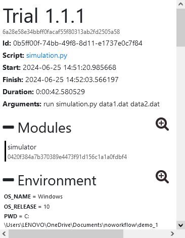
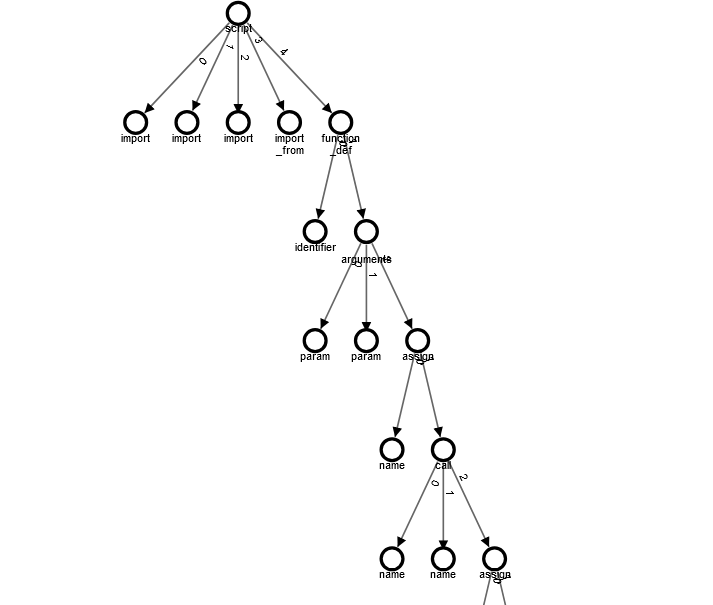

---

# Week 7: Constructing the Trial Graph

In Week 7, I focused on constructing the graph for the TrialGraph. 
The first step was to write an SQL query to fetch the necessary data from the database:

```sql
SELECT 
    ROW_NUMBER() OVER (PARTITION BY c.whole_id ORDER BY c.id) - 1 AS index_,
    c.*, 
    cc.name, 
    cc.type
FROM code_component cc 
JOIN composition c
    ON c.part_id = cc.id
WHERE 
    c.trial_id = '0b5ff00f-74bb-49f8-8d11-e1737e0c7f84' 
    AND cc.trial_id = '0b5ff00f-74bb-49f8-8d11-e1737e0c7f84' 
    AND c.type != '*op_pos'
    AND cc.type != 'syntax';
```

This SQL query is designed to gather the components and their composition relationships for a specific trial. 
The ROW_NUMBER() function is used to assign an index to each row within the partition of the whole_id starting from 0, which helps in ordering and referencing components. 
This index is used later to establish relationships between components in the graph.

Next, I implemented the TrialDefinition class in Python, which is responsible for constructing the 
graph based on the fetched components and compositions:

```python
class TrialDefinition:
    def __init__(self, definitions, def_dict):
        self.activations = defaultdict(lambda: defaultdict(int))
        self.children = []
        self.children_index = 0
        self.duration = defaultdict(int)
        self.full_tooltip = None
        self.name = None
        self.tooltips = defaultdict

        self.definitions = definitions
        self.def_dict = def_dict

        self.stack = []
        self.nodes = []

        self()

    def __call__(self):
        for component in self.components:
            if component.type == 'script' and not self.stack:
                last = self.insert_script(component)
                continue
            if component.type == 'return':
                pass

            node = self.construct_ast_node(component, self.def_dict)
            if node is None:
                continue
            self.node_dict[component.id] = node

        for composition in self.compositions:
            whole_node = self.node_dict.get(composition.whole_id)
            part_node = self.node_dict.get(composition.part_id)

            if whole_node is None or part_node is None:
                if composition.extra is None:
                    continue
            self.construct_ast_relationship(whole_node, part_node, composition)

        return self.node_dict[1]

    def add_edge(self, source, target, type, count=1):
        edge = TrialEdge(
            count={source.trial_id: count},
            source=source,
            target=target,
            type=type
        )

    def insert_node(self, definition, parent, label):
        if label is None:
            label = definition.name
        node = TrialNode(
            activations={definition.trial_id: [definition.id]},
            children=[],
            children_index=-1,
            duration={definition.trial_id: 1},
            full_tooltip=False,
            name=definition.name,
            tooltip={definition.trial_id: label},
            trial_ids=[definition.trial_id]
        )
        if parent is not None:
            node.parent_index = parent.index
            node.children_index = len(parent.children)
            parent.children.append(node)
        return node

    def insert_script(self, definition):
        self.root = node = self.insert_node(definition, None)
        self.add_edge(node, node, 'initial')
        self.stack.append(node)
        return self.call(definition, node)

    def insert_call(self, definition, last):
        pass

    def insert_sequence(self, definition, last):
        pass

    def insert_return(self, last):
        pass
```

Most of the logic defined here is adapted from the `TrialAst` class. 
The first for loop in the `__call__` function is responsible for inserting nodes based on the type of edge that will be used. 
Nodes in the graph are represented by instances of the `TrialNode` class, which are inserted into the graph by linking them to their parent nodes.

The `TrialNode` class, which structures each node, is implemented using DotDict:

```python
class DotDict(dict):
    """Dict that can be accessed by attributes"""
    def __getattr__(self, attr):
        if attr in self:
            return self[attr]
        return dict.__getattr__(self, attr)
    __setattr__ = dict.__setitem__
    __delattr__ = dict.__delitem__
```

`DotDict`, from the noWorkflow codebase, allows dictionary items to be accessed as attributes, simplifying the manipulation of node properties. 
This design makes the `TrialNode` class more intuitive and easier to work with, especially when constructing and managing complex graph structures.

# Week 8: Enhancing the Definition Model

After discussions with my mentor, I realized that using the existing proxy models defined in the noWorkflow codebase would be more efficient 
than creating a new SQL query with similar functionalities. 
Consequently, I decided to discard the previous SQL query approach and instead implement the `Model` class from base.py.

Since the graph represents the script, I am using the `CodeComponent` model and referencing it with `trial.code_components` from relationship.py. 
This approach aligns better with the existing codebase and simplifies the implementation.

The updated model is now defined in definition.py, which focuses on creating a definition of the trial and displaying the graph accordingly.

```python
# Copyright (c) 2016 Universidade Federal Fluminense (UFF)
# Copyright (c) 2016 Polytechnic Institute of New York University.
# This file is part of noWorkflow.
# Please, consult the license terms in the LICENSE file.
"""Definition Object"""
from __future__ import (absolute_import, print_function,
                        division, unicode_literals)

from collections import OrderedDict

from future.utils import viewkeys

from ..persistence.models.base import Model, proxy_gen
from ..persistence.models.trial import Trial
from .graphs.definition_graph import DefinitionGraph


class Definition(Model):
    """This model represents a definition of trials
    Initialize it by passing a trials id:
        definition = Definition(1)

    There are four visualization modes for the graph:
        tree: activation tree without any filters
            diff.graph.mode = 0
        no match: tree transformed into a graph by the addition of sequence and
                  return edges and removal of intermediate call edges
            diff.graph.mode = 1
        exact match: calls are only combined when all the sub-call match
            diff.graph.mode = 2
        namesapce: calls are combined without considering the sub-calls
            diff.graph.mode = 3


    You can change the graph width and height by the variables:
        diff.graph.width = 600
        diff.graph.height = 400
    """

    __modelname__ = "Definition"

    DEFAULT = {
        "graph.width": 500,
        "graph.height": 500,
        "graph.mode": 0,
        "graph.use_cache": False
    }

    REPLACE = {
        "graph_width": "graph.width",
        "graph_height": "graph.height",
        "graph_mode": "graph.mode",
        "graph_use_cache": "graph.use_cache"
    }

    def __init__(self, trial_ref, **kwargs):
        super(Definition, self).__init__(trial_ref, **kwargs)
        self.trial = Trial(trial_ref)
        self.graph = DefinitionGraph(self)
        self.initialize_default(kwargs)

    @property
    def modules(self):
        """Diff modules from trials"""
        return self.trial.modules

    @property
    def environment(self):
        """Diff environment variables"""
        return self.trial.environment_attrs

    @property
    def file_accesses(self):
        """Diff file accesses"""
        return self.trial.file_accesses

    def _ipython_display_(self):
        from IPython.display import display
        bundle = {
            'application/noworkflow.trial+json': self._modes[self.mode]()[1],
            'text/plain': 'Trial {}'.format(self.trial.id),
        }
        display(bundle, raw=True)
```

The Definition class is initialized by passing a trial ID and provides various properties to access different aspects of the trial data. 
It supports four visualization modes for the graph: tree, no match, exact match, and namespace. 
For our purposes, we use only the "tree" mode, as it suffices for displaying the script structure without needing to 
illustrate the execution flow, similar to an AST structure. 
Property wrappers in the class facilitate the display of relevant information such as used modules and local environment details.



Next, I implemented the DefinitionGraph class, which defines the graph structure and includes methods for manipulating it:

```python
# Copyright (c) 2016 Universidade Federal Fluminense (UFF)
# Copyright (c) 2016 Polytechnic Institute of New York University.
# This file is part of noWorkflow.
# Please, consult the license terms in the LICENSE file.
"""Trial Graph Module"""
from __future__ import (absolute_import, print_function,
                        division, unicode_literals)

import weakref
import ast

from collections import defaultdict

from future.utils import viewitems

from .structures import prepare_cache, Graph
from ...persistence.models.code_component import CodeComponent
from .trial_graph import Node

cache = prepare_cache(                                                           # pylint: disable=invalid-name
    lambda self, *args, **kwargs: "trial {}".format(self.trial.trial.id))


class DefinitionGraph(Graph):
    """Definition Graph Class
       Present definition graph on Jupyter"""

    def __init__(self, trial):
        self.trial = weakref.proxy(trial)

        self.match_id = 0
        self.use_cache = False
        self.width = 500
        self.height = 500
        self.mode = 0
        self._modes = {
            0: self.tree,
            1: self.no_match,
            2: self.exact_match,
            3: self.namespace_match
        }


    def define_node(self, preorder, relationship):
        for node in preorder:
            if node.type == 'script':
                root = last = self.insert_node(node, None)
                continue
            elif node.type != 'syntax':
                 for relation in relationship:
                    if last.node_id == relation.whole_id and node.id == relation.part_id:
                        last = self.insert_node(node, last)
                        relationship.remove(relation)
                        break
                    else:
                        match = self.calculate_match(node)
                        find = self.matches[last.parent_index].get(match)
                        if find is None:
                            last = self.insert_node(node, self.nodes[last.parent_index], match)
                            relationship.remove(relation)
                            break
        return root

    def add_edge(self, source, target, type_, count=1):
        """Add edge"""
        ids = target.trial_ids
        trial_id = 0 if len(ids) > 1 else next(iter(ids))
        self.edges[source.index][target.index][type_][trial_id] += count

    def insert_node(self, node_, parent, match=None):
        """Create node"""
        node = Node(
            index=self.index,
            name=node_.type,
            parent_index=-1,
            children_index=-1,
            children=[],
            node_id = node_.id,
            activations=defaultdict(list),
            duration=defaultdict(int),
            full_tooltip=True,
            tooltip=defaultdict(str),
            trial_ids=[],
            has_return=False,
        )
        # self.merge(node, node_)
        trial_id = node_.trial_id
        if trial_id not in node.trial_ids:
            node.trial_ids.append(trial_id)
        node.activations[trial_id].append(node_.id)
        node.duration[trial_id] += 0

        node.tooltip[trial_id] += "T{} - {}<br>Name: {}<br>Type: {}<br>".format(
            trial_id, node_.id, node_.name, node_.type
        )

        self.index += 1
        if parent is not None:
            node.parent_index = parent.index
            node.children_index = len(parent.children)
            parent.children.append(node)
            if match is not None:
                self.matches[parent.index][match] = node

        self.nodes.append(node)
        return node

    def calculate_match(self, node):
        """No match"""
        self.match_id += 1
        return self.match_id

    def result(self, components, compositions):
        """Get summarization graph result"""
        # return self.trial.finished, summarization.graph(
        #     {self.trial.id: 0}, self.width, self.height
        # ), summarization.nodes
        self.index = 0
        self.nodes = []
        self.matches = defaultdict(dict)
        self.edges = defaultdict(
            lambda: defaultdict(lambda: defaultdict(lambda: defaultdict(int)))
        )
        root = self.define_node(components, compositions)
        stack = [root]
        edges = []
        while stack:
            current = stack.pop()
            for index, child in enumerate(current.children):
                self.add_edge(current, child, 'call', index)
                stack.append(child)
        for source_nid, targets in viewitems(self.edges):
            for target_nid, types in viewitems(targets):
                for type_, count in viewitems(types):
                    edges.append({
                        'count': count,
                        'source': source_nid,
                        'target': target_nid,
                        'type': type_,
                    })
        min_duration = 0
        max_duration = 1
        trials = set()
        for node in self.nodes:
            for trial_id in node.trial_ids:
                trials.add(trial_id)
        tlist = list(trials)
        if not tlist:
            tlist.append(0)
        graph = {
            'root': root,
            'edges': edges,
            'min_duration': {self.trial.trial.id: min_duration},
            'max_duration': {self.trial.trial.id: max_duration},
            'colors': {self.trial.trial.id: 0},
            'trial1': tlist[0],
            'trial2': tlist[-1],
            'width': self.width,
            'height': self.height,
        }
        finished = self.trial.trial.finished
        return finished, graph, self.nodes

    @cache("tree")
    def tree(self):
        """Convert tree structure into dict tree structure"""
        return self.result(self.trial.trial.code_components, CodeComponent.compositions(self.trial.trial.id))

    @cache("no_match")
    def no_match(self):
        """Convert tree structure into dict graph without node matchings"""
        # ToDo if needed
        pass

    @cache("exact_match")
    def exact_match(self):
        """Convert tree structure into dict graph and match equal calls"""
        # ToDo if needed
        pass

    @cache("namespace_match")
    def namespace_match(self):
        """Convert tree structure into dict graph and match namespaces"""
        # ToDo if needed
        pass

    def _ipython_display_(self):
        from IPython.display import display
        bundle = {
            'application/noworkflow.trial+json': self._modes[self.mode]()[1],
            'text/plain': 'Trial {}'.format(self.trial.trial.id),
        }
        display(bundle, raw=True)

```

The `DefinitionGraph` class, defined in definition_graph.py, extends the `Graph` class and used for visualizing the structure of trial definitions. 
It utilizes a caching mechanism to optimize performance when processing large graphs. 
This class outlines how nodes and edges are managed and visualized:
- Node Definition: Nodes in the graph represent various components of the trial. The `insert_node` method creates these nodes and manages their attributes. This method also handles the graphical representation of nodes, including tooltips and activation details.
- Edge Management: Edges are established between nodes to illustrate relationships between each nodes. The `add_edge` method ensures that these relationships are accurately reflected in the graph.
- Graph Construction: The `define_node` method builds the graph structure by linking nodes according to their relationships. It uses a preorder traversal approach to insert nodes and manage their hierarchical structure.
- Visualization: The result method prepares the data for visualization, converting the graph structure into a format suitable for rendering. This includes managing node and edge details, trial IDs, and other attributes necessary for accurate representation.

The views.py file now includes a route for serving the definition graph as JSON. 
This endpoint allows users to retrieve the graph data in a format suitable for visualization or further processing.

'''python
@app.route("/experiments/<expCode>/definition/<tid>/<graph_mode>/<cache>.json")
@app.route("/definition/<tid>/<graph_mode>/<cache>.json")
def definition_graph(tid, graph_mode, cache,expCode=None):
    """Respond definition graph as JSON"""
    definition = Definition(tid)
    graph = definition.graph
    graph.use_cache &= bool(int(cache))
    _, tgraph, _ = getattr(graph, graph_mode)()
    return jsonify(**tgraph)
'''

# Some _Root_ Problem



As shown in the image above, the graph is indeed created, but there are some minor issues with its structure. 
Instead of child nodes referencing their parent nodes at the same level, the nodes continue to reference their parent nodes, leading to a recursive tree structure that becomes progressively deeper.

This problem can be resolved by implementing a stack mechanism to keep track of parent nodes during node insertion. 
This way, when a child node needs to reference a parent node, it will correctly point to the direct parent instead of continuing the recursive referencing.

---

After addressing this issue, I plan to write an issue regarding the hover mechanism in the noworkflow interface, which currently fails to display the correct information.
