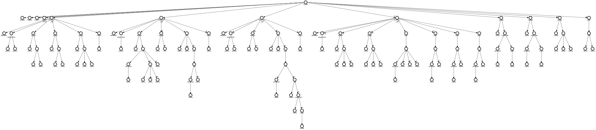
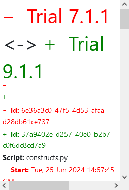

---

# Graph Structure

After completing the initial graph, I encountered issues with the structure of the root and how child nodes reference their parent nodes. 
The main problem was that child nodes were `hardcoded` to reference the last inserted node, 
which caused problems in building accurate parent-child relationships. 
This approach was initially based on the logic used in tree graphs for activations.

To address this issue, I found a solution that avoids relying on the last inserted node. 
Instead of iterating through nodes in a preorder traversal and checking if the last node IDs (whole and part) 
match the relationship of available compositions, I changed the logic to directly check each node against its relationships.

For each relationship, the new logic checks if the current node matches the part_id in the relationship. 
If they match, it finds the parent node (`whole_id`) in the existing nodes and inserts the current node as a child of this parent. 
This approach is similar with `TrialAST` implementation of root building and ensures that
nodes are accurately linked based on their true parent-child relationships.

## define_node

Below is the refined `define_node` method that implements this new logic:

```python
def define_node(self, preorder, compositions):
        relationship = compositions
        for node in preorder:
            if node.type == 'script':
                root = self.insert_node(node, None)
                continue
            elif node.type != 'syntax':
                 for relation in relationship:
                    if node.id == relation.part_id:
                            find = next((n for n in self.nodes if n.node_id == relation.whole_id), None)
                            self.insert_node(node, find)
                            relationship.remove(relation)
                            break
        return root
```
The refined define_node method simplified the node insertion process by focusing on direct parent-child relationships
defined in the compositions. It ensures nodes are correctly linked based on their types and relationships
This method effectively manages node insertion by directly referencing parent nodes (`whole_id`) and their child nodes (`part_id`), 
making the graph construction more efficient and easier to follow.

## label revise

My mentor mentioned that the labels should not be the name of the node (`CodeComponent`). 
There are specific node that should be only the type of node, the combine name and type, and even the more specific node like `Attribute` 
that needed futher text processing. 

```python
def insert_node(self, node_, parent):
    """Create node"""
    node = Node(
        index=self.index,
        name=node_.type + " | " + node_.name,
        parent_index=-1,
        children_index=-1,
        children=[],
        node_id=node_.id,
        activations=defaultdict(list),
        duration=defaultdict(int),
        full_tooltip=True,
        tooltip=defaultdict(str),
        trial_ids=[],
        has_return=False,
    )

    if node_.type in {'global', 'nonlocal', 'assert', 'raise', 'await', 'yield', 'yield_from'}:
        node.name = node_.name
    elif node_.type == 'return':
        node.name = node_.type
    elif node_.type == 'attribute':
        node.name = node_.name.split('.')[1]
    ...
```

A Node object is initialized with various attributes. The label by default is initialized by `name | type`
Depending on the type of the node, the name attribute of the node which reponsible for the label of the node is adjusted accordingly:

- For types like `global`, `nonlocal`, `assert`, `raise`, `await`, `yield`, and `yield_from`, the node's name remains as node_.name.
- For `return` type nodes, the name is set to node_.type.
- For `attribute` type nodes, the name is derived from splitting node_.name and taking the second part. The reason being is because the node's name is formatted `name.attr`

---

Here is the corrected graph structure:


# Diff Graph

To finish the assignment of the definition graph with the help of my mentor, I created a Diff feature for the definition graph.
This feature visualizes the differences between the definitions, highlighting how they differ or align.

```python
# Copyright (c) 2016 Universidade Federal Fluminense (UFF)
# Copyright (c) 2016 Polytechnic Institute of New York University.
# This file is part of noWorkflow.
# Please, consult the license terms in the LICENSE file.
"""Definition Diff Object"""
from __future__ import (absolute_import, print_function,
                        division, unicode_literals)

from collections import OrderedDict

from future.utils import viewkeys

from ..persistence.models.base import Model, proxy_gen
from .definition import Definition
from .graphs.definition_diff_graph import DefinitionDiffGraph
from .diff import diff_dict, diff_set


class DefinitionDiff(Model):
    """This model represents a diff between two trials
    Initialize it by passing both trials ids:
        definition_diff = DefinitionDiff(1, 2)

    There are four visualization modes for the graph:
        tree: activation tree without any filters
            definition_diff.graph.mode = 0
        no match: tree transformed into a graph by the addition of sequence and
                  return edges and removal of intermediate call edges
            definition_diff.graph.mode = 1
        exact match: calls are only combined when all the sub-call match
            definition_diff.graph.mode = 2
        namesapce: calls are combined without considering the sub-calls
            definition_diff.graph.mode = 3


    You can change the graph width and height by the variables:
        definition_diff.graph.width = 600
        definition_diff.graph.height = 400
    """

    __modelname__ = "DefinitionDiff"

    DEFAULT = {
        "graph.width": 500,
        "graph.height": 500,
        "graph.mode": 3,
        "graph.time_limit": None,
    }

    REPLACE = {
        "graph_width": "graph.width",
        "graph_height": "graph.height",
        "graph_mode": "graph.mode",
        "graph_time_limit": "graph.time_limit",
    }

    def __init__(self, trial_ref1, trial_ref2, **kwargs):
        super(DefinitionDiff, self).__init__(trial_ref1, trial_ref2, **kwargs)
        self.definition1 = Definition(trial_ref1)
        self.definition2 = Definition(trial_ref2)

        self.graph = DefinitionDiffGraph(self)
        self.initialize_default(kwargs)

    @property
    def trial(self):
        """Return a tuple with information from both trials """
        extra = ("start", "finish", "duration_text", "code_hash")
        ignore = ("id",)
        return diff_dict(
            self.definition1.trial.to_dict(
                ignore=ignore, extra=extra),                     # pylint: disable=no-member
            self.definition2.trial.to_dict(ignore=ignore, extra=extra))                     # pylint: disable=no-member

    @property
    def modules(self):
        """Definition diff modules from trials"""
        return diff_set(
            set(proxy_gen(self.definition1.trial.modules)),
            set(proxy_gen(self.definition2.trial.modules)))

    @property
    def environment(self):
        """Definition diff environment variables"""
        return diff_set(
            set(self.definition1.trial.environment_attrs),
            set(self.definition2.trial.environment_attrs))

    @property
    def file_accesses(self):
        """Definition diff file accesses"""
        return diff_set(
            set(self.definition1.trial.file_accesses),
            set(self.definition2.trial.file_accesses),
            create_replaced=False)

    def _ipython_display_(self):
        """Display history graph"""
        if hasattr(self, "graph"):
            # pylint: disable=protected-access
            return self.graph._ipython_display_()
        from IPython.display import display
        display({
            'text/plain': 'Diff {}:{}'.format(
                self.definition1.trial.id,
                self.definition2.trial.id
            )
        })
```

This graph is used to visualized the difference of definitions of two trials. It contain the same structure but has
the combined two roots of the two trials. It also has the necessary property for the info needed for the graph, similar to the definition graph



Then, I implemented the `DefinitionDiffGraph` class, which extends the `Graph` class to handle the specific needs of showing diffs.:

```python
# Copyright (c) 2017 Universidade Federal Fluminense (UFF)
# Copyright (c) 2017 Polytechnic Institute of New York University.
# This file is part of noWorkflow.
# Please, consult the license terms in the LICENSE file.
"""Definition Diff Graph Module"""
from __future__ import (absolute_import, print_function,
                        division, unicode_literals)

import weakref

from copy import copy
from collections import defaultdict
from functools import cmp_to_key

from apted import meta_chained_config, Config, APTED
from future.utils import viewitems

from .trial_graph import Node
from .structures import Graph, prepare_cache
from .diff_graph import CONFIG, children_cmp, create_mapping, merge, merge_edges 


def create_diff(trial_graph1, trial_graph2):
    """Creates a graph structure that combines both graphs"""
    # pylint: disable=too-many-locals
    finished1, graph1, _ = trial_graph1
    finished2, graph2, _ = trial_graph2
    root, id_to_node1, id_to_node2 = create_mapping(
        graph1['root'], graph2['root']
    )

    nodes = []
    index = 1
    queue = [root]
    visited = {id(root)}
    visited_queue = set()
    while queue:
        node = queue.pop()
        nodes.append(node)
        node.index = index
        node.children = []
        for ochild in node.children1:
            child = id_to_node1[ochild.index]
            if id(child) not in visited:
                node.children.append(child)
                child.caller_id = child.parent_index = index
                visited.add(id(child))
        for ochild in node.children2:
            child = id_to_node2[ochild.index]
            if id(child) not in visited:
                node.children.append(child)
                child.caller_id = child.parent_index = index
                visited.add(id(child))
        del node.children1
        del node.children2
        node.children.sort(key=children_cmp)

        lchildren = len(node.children) - 1
        for cindex, child in enumerate(reversed(node.children)):
            if id(child) not in visited_queue:
                queue.append(child)
            child.children_index = lchildren - cindex
            visited_queue.add(id(child))
        index += 1

    graph = {
        'root': root,
        'edges': merge_edges(
            graph1['edges'], graph2['edges'],
            id_to_node1, id_to_node2
        ),
        'min_duration': {},
        'max_duration': {},
        'colors': {
            graph1["trial1"]: 1,
            graph2["trial1"]: 2,
        },
        'trial1': graph1["trial1"],
        'trial2': graph2["trial1"],
        'width': graph1['width'],
        'height': graph1['height'],
    }
    graph['min_duration'].update(graph1['min_duration'])
    graph['min_duration'].update(graph2['min_duration'])
    graph['max_duration'].update(graph1['max_duration'])
    graph['max_duration'].update(graph2['max_duration'])
    finished = finished1 and finished2
    return finished, graph, nodes


cache = prepare_cache(  # pylint: disable=invalid-name
    lambda self, *args, **kwargs: "diff {}:{}".format(self.diff.definition1.trial.id,
                                                      self.diff.definition2.trial.id))

class DefinitionDiffGraph(Graph):
    """Diff Graph Class. Present diff graph on Jupyter"""

    def __init__(self, diff):
        self.diff = weakref.proxy(diff)
        self.use_cache = False
        self.width = 500
        self.height = 500

        self.mode = 0

        self._modes = {
            0: self.tree,
            1: self.no_match,
            2: self.exact_match,
            3: self.namespace_match
        }

    @cache("tree")
    def tree(self):
        """Convert tree structure into dict tree structure"""
        return create_diff(
            self.diff.definition1.graph.tree(),
            self.diff.definition2.graph.tree()
        )

    @cache("no_match")
    def no_match(self):
        """Convert tree structure into dict graph without node matchings"""
        pass

    @cache("exact_match")
    def exact_match(self):
        """Convert tree structure into dict graph and match equal calls"""
        pass

    @cache("namespace_match")
    def namespace_match(self):
        """Convert tree structure into dict graph and match namespaces"""
        pass

    def _ipython_display_(self):
        from IPython.display import display
        bundle = {
            'application/noworkflow.trial+json': self._modes[self.mode]()[1],
            'text/plain': 'Diff {}:{}'.format(
                self.diff.definition1.trial.id,
                self.diff.definition2.trial.id
            ),
        }
        display(bundle, raw=True)

```

It has the mostly same code for the `DiffGraph`, only for the how to capture the tree cache is modified.
Instead of using the trial graph, it used the definition graph instead. 
The `create_diff` function combines two trial graphs by mapping nodes and merging edges. 
It creates a new graph structure that integrates nodes and edges from both trials, allowing for a side-by-side comparison.


Finally, I added a new route that serves the difference graph between two trial definitions as a JSON response. 
This allows users to request and visualize the differences directly through the API.

```python
...
from ..models.definition_diff import DefinitionDiff
...

...
@app.route("/experiments/<expCode>/diff/<trial1>/<trial2>/<graph_mode>-<cache>.json")
@app.route("/definition/diff/<trial1>/<trial2>/<graph_mode>-<cache>.json")
def definition_diff_graph(trial1, trial2, graph_mode, cache,expCode=None):
    """Respond definition diff graph as JSON"""
    diff_object = DefinitionDiff(trial1, trial2)
    graph = diff_object.graph
    graph.use_cache &= bool(int(cache))

    _, diff_result, _ = getattr(graph, graph_mode)()
    return jsonify(**diff_result)
...
```

This is the example of the definition diff graph:


The colors in the graph indicate the existence of nodes and edges in the trials:
- Red Border: The node exists only in the first trial.
- Green Border: The node exists only in the second trial.
- Black Vertical Line: The node exists in both trials.

Edges follow the same color scheme, indicating their presence in either or both trials.
    
---

For week 10, I'll focused to implement the interface of the noWorkFlow new feature `DefinitionGraph`, `DefinitionDiffGraph`, and `TrialAST`.
