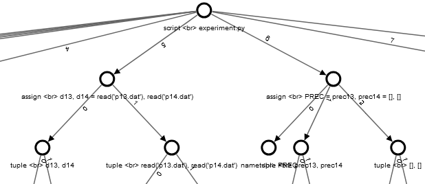
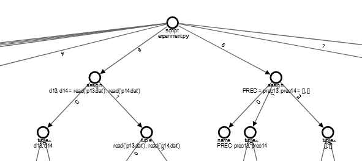

---

# Refactoring

This week, I focused on refactoring the code to enhance readability and abstraction. 
The refactoring primarily involved the following files:

- definition.py
- definition_graph.py
- definition_diff.py
- definition_diff_graph.py
- views.py

## definition.py & definition_diff.py

The graph_mode supports only one mode: tree. 
Consequently, I updated the documentation to reflect this change, simplifying the available options.

```diff
-    There are four visualization modes for the graph:
-        tree: activation tree without any filters
+    There are one visualization modes for the graph:
+        definition_tree: definition tree without any filters
-            definition.graph.mode = 0
-        no match: tree transformed into a graph by the addition of sequence and return edges and removal of intermediate call edges
-            definition.graph.mode = 1
-        exact match: calls are only combined when all the sub-call match
-            definition.graph.mode = 2
-        namesapce: calls are combined without considering the sub-calls
-            definition.graph.mode = 3
```

## definition_graph.py

With the graph modes streamlined, I also needed to adjust the `@cache` decorator and the `__init__` method. 
Additionally, I removed outdated code that incorrectly saved the cache with the trial prefix.

```diff
cache = prepare_cache(                                                           # pylint: disable=invalid-name
-    lambda self, *args, **kwargs: "trial {}".format(self.trial.trial.id))
+    lambda self, *args, **kwargs: "definition {}".format(self.trial.trial.id))

...

        self._modes = {
            0: self.tree,
-            1: self.no_match,
-            2: self.exact_match,
-            3: self.namespace_match
        }

...  

-    @cache("no_match")
-    def no_match(self):
-        """Convert tree structure into dict graph without node matchings"""
-        # ToDo if needed
-        pass

-    @cache("exact_match")
-    def exact_match(self):
-        """Convert tree structure into dict graph and match equal calls"""
-        # ToDo if needed
-        pass

 -   @cache("namespace_match")
 -   def namespace_match(self):
 -       """Convert tree structure into dict graph and match namespaces"""
 -       # ToDo if needed
 -       pass
```

## definition_diff_graph.py

The `definition_diff_graph.py` file contained redundant code that was already present in `diff_graph`. 
To avoid duplication and ensure maintainability, I refactored the file to reuse existing functions:

```diff
+ from .diff_graph import CONFIG, children_cmp, create_mapping, merge, merge_edges

...

- CONFIG = meta_chained_config(NowConfig)()

- @cmp_to_key
- def children_cmp(node1, node2):
...

- def merge(node1, node2, id_to_node1, id_to_node2):
...

- def create_mapping(root1, root2):
...

- def merge_edges(edges1, edges2, id_to_node1, id_to_node2):
...

- def create_diff(trial_graph1, trial_graph2):
...
```

## views.py

Last week, I hardcoded the trial's route for displaying and testing the definition graph.
Now, the route logic is more flexible, distinguishing between different `graph_mode` values:

```diff
@app.route("/trials/<tid>/<graph_mode>/<cache>.json")
def trial_graph(tid, graph_mode, cache,expCode=None):
    """Respond trial graph as JSON"""
-    # trial = Trial(tid)
-    trial = Definition(tid)
+    if "definition" in graph_mode :
+        trial = Definition(tid)
+        graph_mode = graph_mode.split('_')[1]
+    else:
+        trial = Trial(tid)
    graph = trial.graph
    graph.use_cache &= bool(int(cache))
-    _, tgraph, _ = getattr(graph, "tree")()
+    _, tgraph, _ = getattr(graph, graph_mode)()
    return jsonify(**tgraph)

@app.route("/definition/diff/<trial1>/<trial2>/<graph_mode>-<cache>.json")
def diff_graph(trial1, trial2, graph_mode, cache,expCode=None):
    """Respond trial diff graph as JSON"""
-    # diff_object = Diff(trial1, trial2)
-    diff_object = DefinitionDiff(trial1, trial2)
+    if "definition" in graph_mode :
+        diff_object = DefinitionDiff(trial1, trial2)
+        graph_mode = graph_mode.split('_')[1]
+    else:
+        diff_object = Diff(trial1, trial2)
    graph = diff_object.graph
    graph.use_cache &= bool(int(cache))

-    _, diff_result, _ = getattr(graph, 'tree')()
+    _, diff_result, _ = getattr(graph, graph_mode)()
    return jsonify(**diff_result)
```

# Interface added

With the npm package issues resolved, I was able to add an interface for displaying the graph. 
This began with updating the dropdown list to include the new definition options, which are displayed for both trial and diff views.

```typescript
    let typeOptions = graphType.append("select")
          .attr("id", name + "-graphtype")
          .classed("graph-type", true)
          .classed("select-style", true);

    ...

    typeOptions.append("option")
          .attr("value", "definition_tree")
          .attr("data-description", "Definition tree. Edges represent order of script definition")
          .text("Definition Tree")
```

Next, there was a visual bug where node labels were cluttered, making the graph difficult to read



To address this, I implemented a multiline label feature where the first line displays the node's type and the second line shows the name or content of the node.
The `insert_node` function in `definition_graph.py` was used to handle the node visualization in `trial/graph.ts`

```typescript
    // Text for new nodes
    nodeEnter.append('text')
      .attr("dy", ".35em")
      .attr("font-family", "sans-serif")
      .attr("font-size", this.config.fontSize + "px")
      .attr("pointer-events", "none")
      .attr("fill", "#000")
      .attr("y", 24)
      .attr("x", 10)
      .attr("text-anchor", "middle")
      .each(function(d: VisibleTrialNode) {
        const textLabel = d3_select(this);
        const name = d.data.name.split('<br>');
        if (name.length > 1) {
          textLabel.append("tspan")
            .attr("x", "10")
            .attr("dy", ".35em")
            .text(name[0]);
          textLabel.append("tspan")
            .attr("x", "10")
            .attr("dy", "1em")
            .text(name[1]);
          textLabel.attr("class", "nowrap")
        } else {
          return textLabel.text(d.data.name);
        }
      });
```



# History graph conflict

While implementing the definition graph interface, I encountered an issue where the npm build process overwrote the previous version of the history graph.
This caused the right-click feature to stop working, and the history graph no longer displayed the popup when right-clicked.

---
In the coming days, I will continue exploring solutions to this problem while refining the interface and ensuring that all components work seamlessly together.
